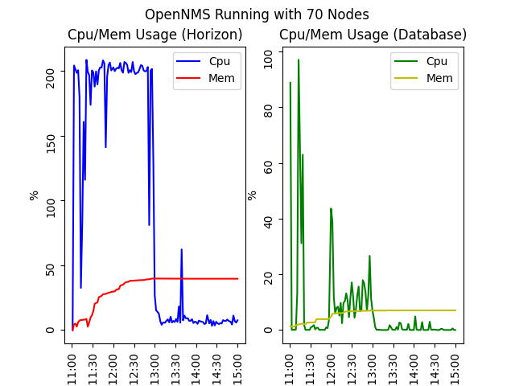

This document is still a **WIP**.


The purpose of this scripts is to make it easier to test adding N number of nodes to an OpenNMS instances that runs locally.

#### Requirements:
* `requests` and `matplotlib` Python3 modules
* [Optional] Docker Desktop, with `Memory` set to `10 GB` and `CPUs` set to `6` under Resources>Advanced 

#### Sample Usage:

Edit `start_test.sh` and customize the parameters (at the end of the file)
```
export OpenNMS_MaxCPU=2
export Postgress_MaxCPU=2
export OpenNMS_MaxMemory="8G"
export Postgress_MaxMemory="2G"

START=1
INCREMENT=10
END=500
````
Next, run `start_test.sh`

## How does it work?

**NOTE:** `XYZ` denotes the number of node we are testing (Example: 10)

When you run `start_test.sh` it,
- Runs a function that is responsible for querying the Docker containers stats and it saves the output into `logs/docker_stats_XYZ.txt`. 
- Runs a function that spins up an OpenNMS and a Postgres container using docker compose, followed by executing `main.py` ( it passes the number of nodes as argument to the Python script); All data is logged under `logs/output_XYZ.txt`

When `main.py` starts, it spawns 3 processes..

1) `main` process is responsible for starting and terminating the forked processes
2) `add_nodes` process is responsible for deleting `selfmonitor` requisition and creating requisition and adding **XYZ** numbers of nodes
3) `query_nodes` process is responsible for querying our requisition to make sure the number of nodes it reports matches with **XYZ**
4) `query_stats` process is responsible for querying all requisition and to make sure the total number of nodes matches with **XYZ**

Once the execution of `main.py` completes, `start_test.sh` script starts a 15 minutes sleep where it continues to log the Docker stats before calling `graphit.py` and then exiting.

When `graphit.py` runs, it looks for `docker_stats_XYZ.txt` files under `logs` folder and for each file it generates a PNG file containing a graph for both `horizon` and `database` containers.


### Example graph:

